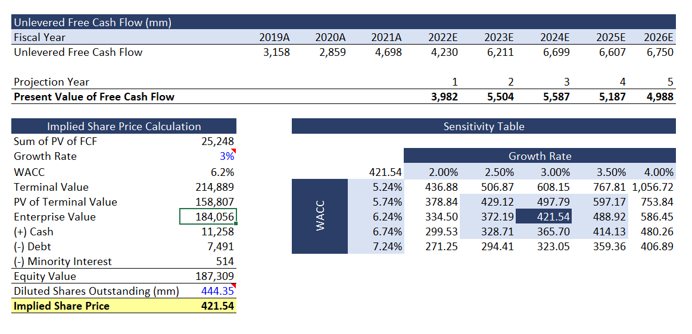

# DCF Valuation Model (Excel)

## Overview
A discounted cash flow (DCF) valuation model built in Excel to estimate the intrinsic value of Costco based on projected unlevered free cash flows and discounting assumptions.

The model incorporates historical financial data (2019A–2021A) and forward projections (2022E–2026E) to estimate enterprise value using a structured valuation framework.

---

## Model Structure

- **Data Source** – Historical financial inputs (2019–2021) - Income Statement, Balance Sheet and Cashflow Statements.
- **Free Cash Flow** – Key assumptions and Projection of unlevered free cash flows (2019A–2026E)
- **Fixed Assets** – Capital expenditure and depreciation modeling
- **Net Working Capital** – Working capital forecasting adjustments
- **WACC** – Weighted Average Cost of Capital calculation
- **DCF** – Discounted cash flow valuation and implied enterprise value

---

## Projection Period
Unlevered Free Cash Flow projections cover:
- 2019A-2021A   
- 2022E-2026E
---

## Model Preview

---
## File
- [Download the Complete Excel Model](./DCF_model.xlsx)

